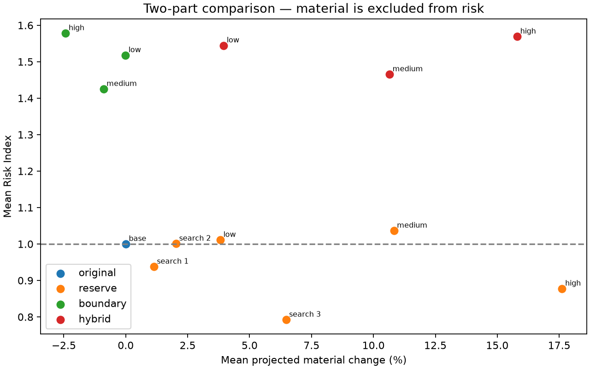
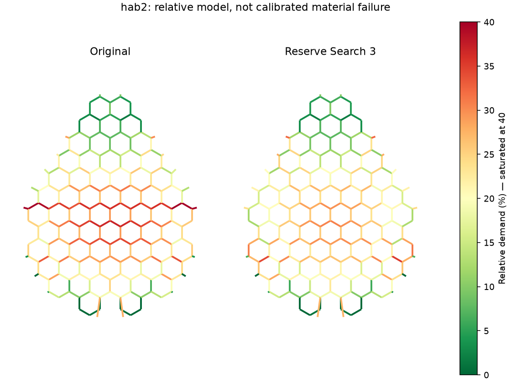
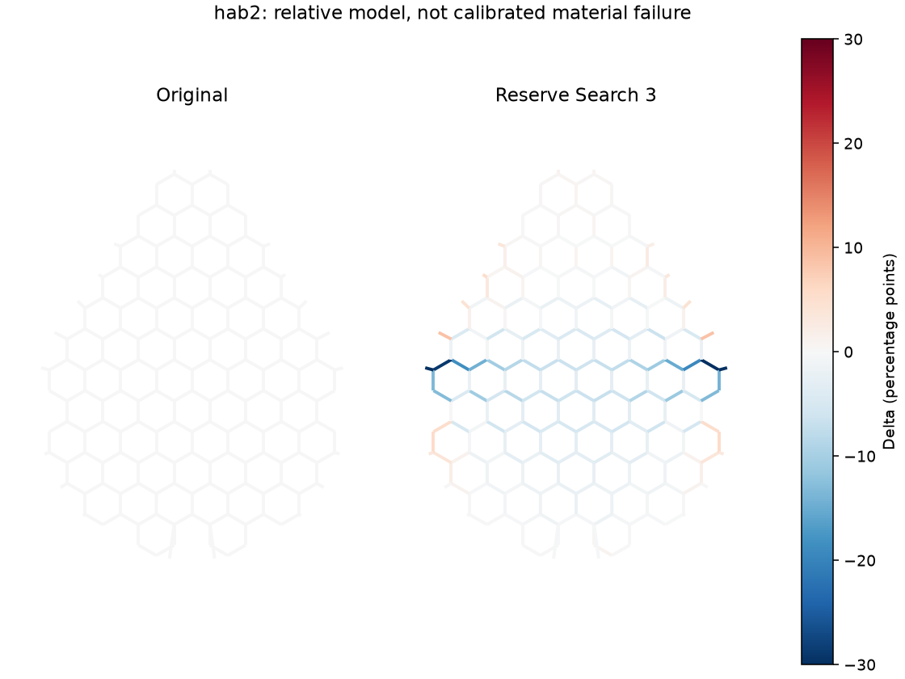
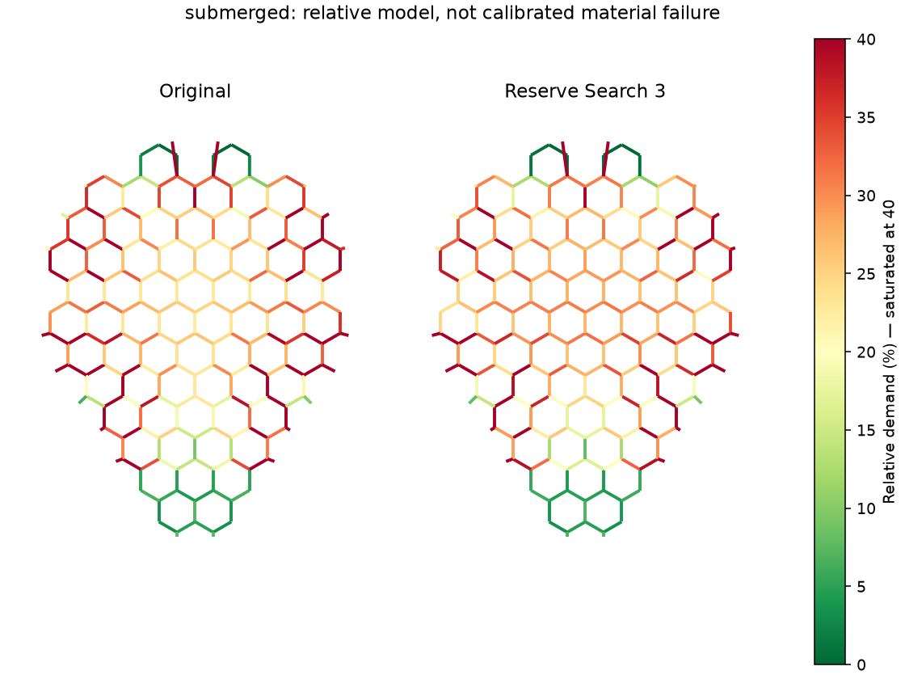
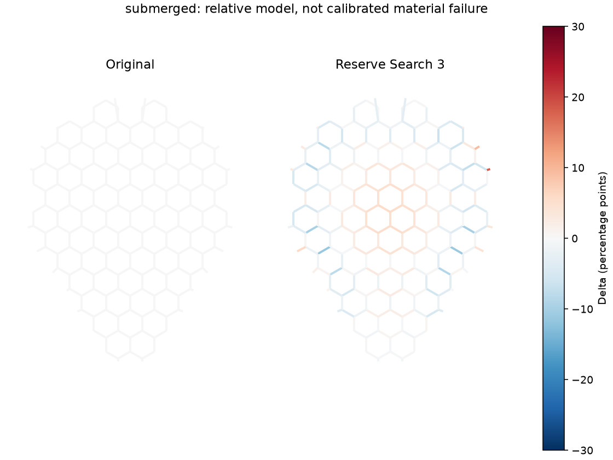

# LampForm Lab v0.5 — Engineering report

Generated: 2026-09-14T16:59:59.122447+00:00

## Baseline problem

The supplied v0.1 and v0.2 solvers were reproduced without editing legacy; deviations below 0.02 percentage point are recorded in `generated/baseline_reproduction.json`. This DOE recomputes its own baseline with exactly the candidate solver. It merges nominally coincident corners at 0.03 mm and includes 20 actual rim connectors: 246 parent ligaments per part. Reported demand is the maximum positive segment strain per physical parent, so subdividing a connector does not dilute percentiles. The original STL are copied byte-for-byte; both contain 503 duplicated faces and are not watertight.

## Design space and mechanisms

Ten initial designs: Original and Low/Medium/High Reserve, Boundary and Hybrid. Reserve reduces cell openings by up to 2/6/10%, spatially smoothed over 12 mm. Boundary contracts the core to 99/98/96% and adds actual S connectors, width 1.20/1.05/0.95 mm and maximum amplitude 0.15/0.35/0.65 mm. Hybrid combines these levels. Nominal boundary-band parameters 0.4/0.8/1.6 mm are converted to isotropic scale using a 40 mm reference; actual gap varies along the perimeter. Boundary changes pitch and connectors together: their individual effects are not isolated. If no pair passes, a bounded second pass tests reserve strengths 0.005, 0.01, 0.035, stopping at the first pass or 13 designs total. Every attempted result is stored in `generated/sweep/` and exposed in the explorer.

## Danger zones and risk

LOW <10%; MODERATE 10–<20%; HIGH 20–30%; CRITICAL >30%. These are relative demand classes, not polymer failure limits. Risk Index = 0.30(P95/P95₀) + 0.25(P99/P99₀) + 0.25(max/max₀) + 0.20(critical fraction/critical fraction₀). Material and open area are excluded. If baseline has zero critical ligaments the denominator floor is one edge. Print gate requires lower P95, fewer >30% ligaments, max ≤ baseline +5 percentage points, valid geometry, closed single body, minimum structural path width and aperture probe. A pair is recommended only when BOTH parts pass. Gates are selection heuristics, not a safety certification.

## Results

| Design | Part | P95 | P99 | Max | Critical | Risk | Material Δ | Gate |
|---|---|---:|---:|---:|---:|---:|---:|---|
| Original | hab2 | 35.98% | 45.29% | 64.33% | 45 | 1.000 | +0.0% | BASE |
| Original | submerged | 55.47% | 70.12% | 83.86% | 98 | 1.000 | +0.0% | BASE |
| Reserve Low | hab2 | 35.35% | 46.73% | 69.03% | 43 | 1.012 | +4.5% | PASS |
| Reserve Low | submerged | 53.26% | 72.81% | 88.13% | 98 | 1.010 | +3.2% | TRADE-OFF |
| Reserve Medium | hab2 | 34.32% | 48.83% | 80.79% | 44 | 1.065 | +12.7% | TRADE-OFF |
| Reserve Medium | submerged | 50.92% | 79.41% | 87.02% | 93 | 1.008 | +8.9% | PASS |
| Reserve High | hab2 | 29.61% | 34.93% | 36.98% | 10 | 0.628 | +20.7% | PASS |
| Reserve High | submerged | 51.44% | 97.61% | 107.80% | 88 | 1.127 | +14.5% | TRADE-OFF |
| Boundary Low | hab2 | 36.09% | 55.50% | 62.38% | 55 | 1.094 | -0.0% | REJECTED |
| Boundary Low | submerged | 112.17% | 161.33% | 182.30% | 106 | 1.942 | -0.0% | REJECTED |
| Boundary Medium | hab2 | 39.97% | 58.10% | 75.23% | 43 | 1.137 | -0.9% | REJECTED |
| Boundary Medium | submerged | 99.51% | 131.07% | 161.99% | 110 | 1.713 | -0.9% | REJECTED |
| Boundary High | hab2 | 47.33% | 73.95% | 87.81% | 60 | 1.411 | -2.4% | REJECTED |
| Boundary High | submerged | 108.82% | 132.17% | 158.89% | 104 | 1.746 | -2.4% | REJECTED |
| Hybrid Low | hab2 | 37.85% | 57.93% | 68.41% | 42 | 1.088 | +4.5% | REJECTED |
| Hybrid Low | submerged | 114.04% | 171.98% | 188.27% | 103 | 2.001 | +3.4% | REJECTED |
| Hybrid Medium | hab2 | 39.81% | 71.34% | 77.18% | 40 | 1.203 | +12.3% | REJECTED |
| Hybrid Medium | submerged | 85.49% | 136.22% | 187.57% | 108 | 1.728 | +9.0% | REJECTED |
| Hybrid High | hab2 | 44.00% | 86.47% | 116.06% | 55 | 1.540 | +18.3% | REJECTED |
| Hybrid High | submerged | 75.66% | 130.86% | 179.33% | 92 | 1.598 | +13.3% | REJECTED |
| Reserve Search 1 | hab2 | 32.65% | 37.77% | 63.03% | 34 | 0.877 | +1.3% | PASS |
| Reserve Search 1 | submerged | 54.49% | 69.90% | 84.00% | 100 | 0.998 | +1.0% | TRADE-OFF |
| Reserve Search 2 | hab2 | 35.55% | 46.54% | 66.90% | 43 | 1.004 | +2.4% | PASS |
| Reserve Search 2 | submerged | 53.91% | 70.35% | 85.52% | 98 | 0.997 | +1.7% | TRADE-OFF |
| Reserve Search 3 | hab2 | 29.72% | 32.24% | 35.06% | 10 | 0.606 | +7.6% | PASS |
| Reserve Search 3 | submerged | 50.59% | 71.25% | 84.63% | 97 | 0.978 | +5.3% | PASS |

## Sensitivity: material, boundary or combination?

- Reserve: two-part Risk Index range 0.878–1.036; 0 pairs passed.
- Boundary: two-part Risk Index range 1.425–1.578; 0 pairs passed.
- Hybrid: two-part Risk Index range 1.465–1.569; 0 pairs passed.

The smallest observed risk in this tested space belongs to reserve. This is a comparison of tested perturbations, not a causal attribution or proof of global optimality. The boundary family alters both pitch and connector shape. A matched-pitch follow-up and physical measurements are needed to isolate rim feed from material amount.

## Rejected candidates

- Reserve Low: submerged: critical_edges
- Reserve Medium: hab2: maximum
- Reserve High: submerged: maximum
- Boundary Low: hab2: p95, hab2: critical_edges, submerged: p95, submerged: critical_edges, submerged: maximum
- Boundary Medium: hab2: p95, hab2: maximum, submerged: p95, submerged: critical_edges, submerged: maximum
- Boundary High: hab2: p95, hab2: critical_edges, hab2: maximum, submerged: p95, submerged: critical_edges, submerged: maximum
- Hybrid Low: hab2: p95, submerged: p95, submerged: critical_edges, submerged: maximum
- Hybrid Medium: hab2: p95, hab2: maximum, hab2: solver_converged, submerged: p95, submerged: critical_edges, submerged: maximum
- Hybrid High: hab2: p95, hab2: critical_edges, hab2: maximum, hab2: solver_converged, submerged: p95, submerged: maximum
- Reserve Search 1: submerged: critical_edges
- Reserve Search 2: submerged: critical_edges

## Geometry changes and map correspondence

Parent IDs preserve lattice topology and the same attachment sites across designs; cell IDs preserve original centers, with scaled positions in boundary families. Delta = candidate parent demand − original parent demand, in percentage points. The maps show exact flat footprints plus the corresponding analytical paths. Equivalent hole size = sqrt(2×hole area/sqrt(3)); this is across-flats only for a regular hexagon. Curved candidates use area-equivalent size. Geometry changed % is symmetric-difference area divided by union area, excluding the retained rim. Hole outlines are re-extracted after all unions/cuts. The formed view shows the analytical network, never a fabricated deformed solid. Its five steps are actual continuation solutions.

## Solver limitations

Geometric draping on the STL top envelope, relative axial stiffness, angular penalty, curved material paths and XY feed are modeled. Axial energy scales with width and segment length; angular energy with width cubed and inverse adjacent length. Every design uses the same rim anchor 2.0, interior anchor 0.0005 and angular weight 0.01. Compliance is actual path length/shape, not an arbitrary anchor discount. Solutions are local minima; convergence by tolerance does not prove global optimality. Cost, optimality and continuation stages are retained. Not modeled: calibrated polymer stress, temperature, E(T), viscoelasticity, heating rate, contact friction, layer anisotropy, damage or real failure strain. The solid rim is not a deformable volume mesh; contact is a top-envelope approximation.

## STL validation and manufacturing

Defaults in `config/manufacturing.yaml`: 0.4 mm line, 0.8 mm structural path, 0.4 mm main-cell gap probe, 1 mm lattice and 4 mm retained rim. Candidates are planar extrusions united with the exact original rim via Manifold and reread from the binary STL. Checks: watertight, one body, no degenerate or duplicate faces, consistent winding, finite coordinates, global dimensions within 0.02 mm and no missing rim volume over 0.01 mm³. The 0.8 mm check covers swept structural paths; the gap probe must fit each main cell. It does not certify every tapered corner, peripheral slot or printer profile. The volume proxy uses original rim volume plus planar area outside the rim times thickness, consistently even for the defective original. All manufacturing flags remain separate from structural gates.

## Physical test recommendation

RECOMMENDED FOR PRINT TEST

Passou os gates nas duas peças. Escolha por menor Risk Index médio entre os aprovados.

RECOMMENDED PHYSICAL TEST
Original vs Reserve Search 3

- Candidate: `HAB-2_TEST_V1_reserve_search_3.stl` and `SubMerged_TEST_V1_reserve_search_3.stl`.
- Reference: `dist/downloads/original/HAB-2.stl` and `dist/downloads/original/Sub-Merged.stl`.
